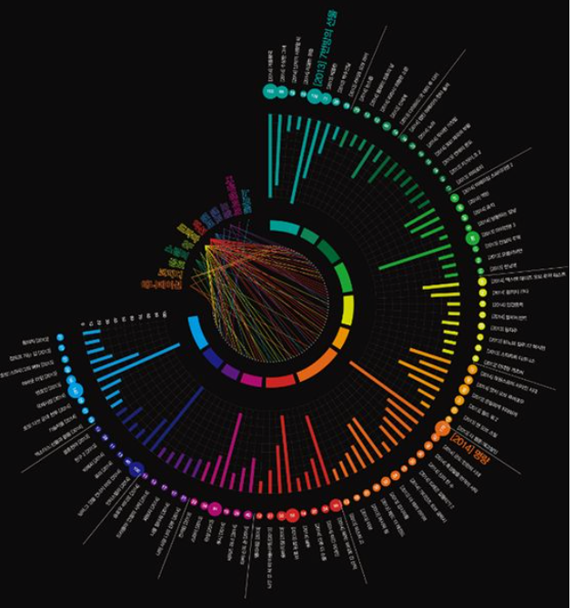
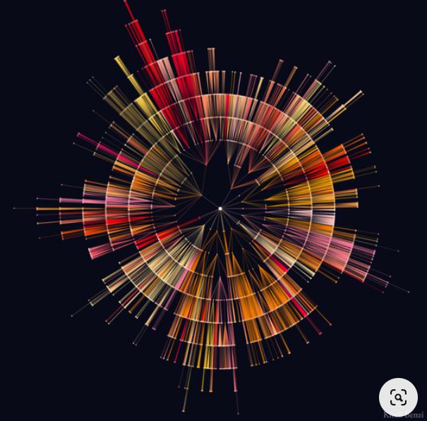
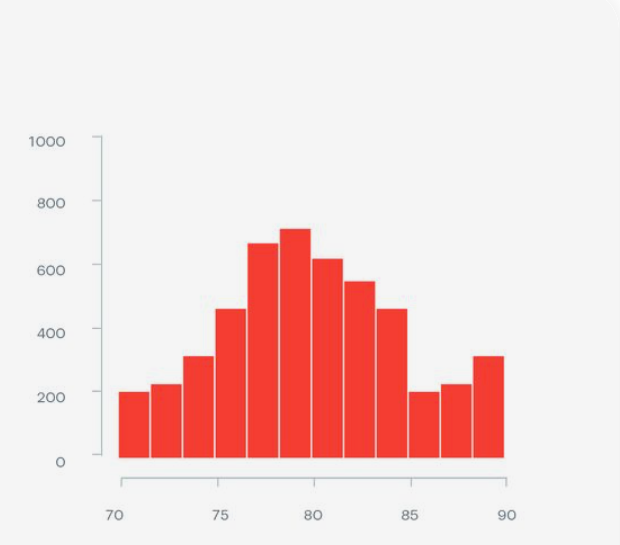

## Nama : Sofyan Fauzi Dzaki Arif 
## NIM : 122450116 
## Kelas : RB

### Bad visualisasi dengan menerapkan 4 prisip dan gambar yang pertama
 
 ## **Bad Visualitation**

**empat prinsip utama visualisasi: Strive for Forms and Functions, ustifying the Selection of Everything We Do, Creating Accessibility through Intuitive Design, dan Never Deceive the Receiver.**

1. **Strive for Forms and Functions *(Mengutamakan Bentuk dan Fungsi)***
Masalah: Visualisasi ini memiliki bentuk yang kompleks, dengan banyak elemen warna dan data yang disusun dalam format radial yang tidak intuitif. Meskipun bentuknya terlihat menarik, fungsinya sebagai alat komunikasi data kurang efektif.
Penjelasan: Bentuk grafik seharusnya mendukung fungsi untuk memudahkan pemahaman data. Pada gambar ini, distribusi data melingkar yang rumit justru mempersulit pengguna untuk dengan cepat memahami makna dan tren yang ingin ditampilkan. Bentuk ini lebih fokus pada aspek estetika daripada fungsi.
2. **Justifying the Selection of Everything We Do *(Membenarkan Pilihan yang Kita Buat)***
Masalah: Tidak ada alasan yang jelas mengapa format radial atau penggunaan banyak warna ini dipilih. Data bisa lebih efektif jika ditampilkan dengan grafik batang linier atau bentuk lain yang lebih mudah diinterpretasikan.
Penjelasan: Setiap elemen dalam visualisasi harus dipilih dengan alasan yang jelas. Di sini, sulit untuk memahami mengapa elemen-elemen tertentu diatur dalam pola melingkar, dengan garis-garis yang menghubungkan titik pusat. Tanpa justifikasi yang jelas, pengguna bisa bingung dan bertanya-tanya tentang logika di balik desain tersebut.
3. **Creating Accessibility through Intuitive Design *(Menciptakan Aksesibilitas melalui Desain yang Intuitif)***
Masalah: Desain ini tidak intuitif. Sulit bagi pengguna untuk memahami hubungan antar data hanya dengan melihatnya. Penggunaan format lingkaran yang rumit dan garis-garis penghubung yang berwarna-warni membuat data lebih sulit diakses oleh berbagai audiens, terutama pengguna awam.
Penjelasan: Desain yang intuitif harus memungkinkan pengguna untuk memahami data dengan cepat tanpa perlu penjelasan tambahan. Visualisasi ini gagal dalam hal itu, karena membutuhkan waktu dan usaha lebih untuk memahami informasi yang terkandung di dalamnya. Ini mengurangi aksesibilitas data.
4. **Never Deceive the Receiver *(Jangan Pernah Menyesatkan Penerima)***
Masalah: Meski tidak secara langsung menyesatkan, visualisasi ini berisiko menciptakan kebingungan yang bisa menyebabkan misinterpretasi data. Garis-garis dan bentuk yang melingkar dapat memberikan persepsi yang salah tentang hubungan atau signifikansi data.
Penjelasan: Visualisasi data yang baik harus secara akurat merepresentasikan data tanpa menyebabkan pengguna menarik kesimpulan yang salah. Dalam visualisasi ini, sulit untuk memahami skala dan proporsi data yang ditampilkan, sehingga pengguna bisa dengan mudah salah mengartikan makna dari garis, lingkaran, dan warna yang digunakan.

1. **Keterbacaan**:
Visualisasi radial dengan banyak elemen yang tersebar ke luar dari pusat seringkali sulit dibaca. Warna-warna yang beragam dengan panjang garis yang berbeda membuatnya sulit bagi pengguna untuk menangkap makna yang jelas dari data tersebut. Keterbacaan rendah menghalangi pengguna untuk memperoleh informasi yang cepat dan jelas dari visualisasi.

2. **Interpretasi**:
Pada visualisasi ini, sangat sulit untuk memahami hubungan atau perbandingan antar data. Pengguna harus bekerja lebih keras untuk memahami informasi yang disajikan. Bentuk yang rumit dan pola radial yang berbelit-belit dapat mempersulit interpretasi karena otak manusia lebih mudah memproses grafik linier daripada grafik radial yang kompleks.
3. **Akurasi**:
Menggunakan format radial seperti ini dapat menyebabkan distorsi dalam persepsi ukuran dan nilai. Elemen-elemen yang berada lebih jauh dari pusat cenderung terlihat lebih besar dari yang sebenarnya, sementara elemen-elemen yang lebih dekat mungkin terlihat lebih kecil, meskipun mungkin memiliki nilai yang sama atau lebih besar. Hal ini dapat mengakibatkan kesalahan interpretasi data.
4. **Kesederhanaan**:
Visualisasi ini mungkin terlihat estetis, tetapi terlalu rumit untuk menangkap informasi secara langsung. Sebuah visualisasi yang baik harus memudahkan pengguna untuk menangkap intisari data dengan cepat dan tanpa kebingungan. Dalam hal ini, terlalu banyak informasi visual seperti garis, warna, dan struktur yang terdistribusi secara radial membuat visualisasi ini tidak sederhana dan menambah beban kognitif bagi pengguna.

## **Good visulitattion**

**empat prinsip utama visualisasi: Strive for Forms and Functions, ustifying the Selection of Everything We Do, Creating Accessibility through Intuitive Design, dan Never Deceive the Receiver.**

1. **Strive for Forms and Functions *(Mengutamakan Bentuk dan Fungsi)***
Fungsi terwujud dengan baik: Histogram ini sangat mudah dipahami dengan bentuk yang sederhana. Penggunaan grafik batang membantu menunjukkan distribusi data, yang cocok untuk menyampaikan informasi seperti frekuensi atau jumlah dalam berbagai interval nilai.
Penjelasan: Bentuk yang digunakan, yaitu batang vertikal, memaksimalkan fungsi visualisasi untuk memperlihatkan tren atau pola distribusi yang jelas, seperti dalam kasus ini distribusi data yang cenderung normal.
2. **Justifying the Selection of Everything We Do *(Membenarkan Pilihan yang Kita Buat)***
Pemilihan format histogram sangat tepat: Menggunakan histogram adalah pilihan yang benar untuk menggambarkan distribusi data berdasarkan kategori atau interval nilai (misalnya nilai antara 70 hingga 90).
Penjelasan: Semua elemen pada visualisasi ini berfungsi dengan baik, mulai dari label sumbu yang jelas hingga tinggi batang yang konsisten dengan frekuensi data, membenarkan pemilihan setiap elemen yang digunakan.
3. **Creating Accessibility through Intuitive Design *(Menciptakan Aksesibilitas melalui Desain yang Intuitif)**
Desain sangat intuitif: Penggunaan warna tunggal (merah) dan distribusi batang yang jelas memudahkan pemirsa untuk memahami informasi secara cepat. Skala pada sumbu y (frekuensi) dan sumbu x (rentang nilai) mudah dibaca.
Penjelasan: Desain ini intuitif karena tidak memerlukan penjelasan tambahan. Pengguna dapat langsung melihat tren distribusi, dengan puncak yang menandai rentang frekuensi tertinggi.
4. **Never Deceive the Receiver *(Jangan Pernah Menyesatkan Penerima)***
Visualisasi ini akurat dan tidak menyesatkan: Setiap batang mewakili jumlah atau frekuensi yang jelas dan proporsional dengan nilai sebenarnya. Tidak ada penggunaan elemen visual yang dapat menimbulkan kesan salah atau menyesatkan pemirsa.
Penjelasan: Skala yang digunakan konsisten dan tidak ada distorsi dalam representasi data, menjadikan visualisasi ini sebagai alat yang jujur dan transparan dalam menyajikan informasi.
Kesimpulan:
Histogram ini adalah contoh good visualization karena:

Fungsionalitasnya baik dengan bentuk yang sederhana.
Pemilihan format sesuai dengan jenis data yang disajikan.
Desain yang mudah diakses dan dipahami.
Menyajikan data secara akurat dan tidak menyesatkan pemirsa.

1. **Keterbacaan**:
Grafik mudah dibaca karena menggunakan plot garis sederhana dengan label yang jelas untuk setiap pohon (Tree 1 hingga Tree 5). Sumbu x dan y diberi label yang sesuai, yaitu "Days old" untuk usia pohon dalam hari dan "Circumference" untuk lingkar batang pohon dalam milimeter, yang membantu pengguna memahami informasi yang disajikan.
Penggunaan warna yang berbeda untuk setiap pohon membantu pengguna membedakan data tanpa kebingungan.
2. **Interpretasi**:
Grafik ini sangat membantu dalam menunjukkan hubungan antara usia pohon dan pertambahan lingkar batangnya. Pertumbuhan pohon dari waktu ke waktu mudah dilihat, dan perbedaan antar pohon juga terlihat dengan jelas, membuatnya mudah untuk diinterpretasi.
Visualisasi ini juga menyoroti perbedaan pertumbuhan setiap pohon dengan penggunaan garis-garis terpisah yang membantu pengguna memahami tren pertumbuhan individual.
3. **Akurasi**:
Sumbu skala yang konsisten dan linear pada grafik membantu memastikan bahwa data tidak distorsi, sehingga pengguna bisa membuat interpretasi yang akurat berdasarkan jarak antara titik data. Garis yang smooth (halus) memperlihatkan perkembangan dari waktu ke waktu, tanpa manipulasi yang memengaruhi persepsi nilai sebenarnya.
Grafik ini tidak menggunakan format yang membingungkan seperti radial atau pie chart yang bisa mendistorsi persepsi data, menjamin akurasi dalam penyampaian informasi.
4. **Kesederhanaan**:
Meskipun ada lima garis yang diwakili oleh lima pohon berbeda, grafik tetap sederhana dan tidak berlebihan. Tidak ada elemen tambahan yang mengalihkan perhatian dari data utama. Warna-warna dipilih dengan kontras yang cukup tinggi untuk memastikan keterbacaan, tetapi tidak terlalu mencolok.
Desain minimalis dengan hanya elemen-elemen yang penting, seperti sumbu, label, dan garis, memastikan data menjadi fokus utama. Penggunaan hanya dua dimensi (usia dan lingkar) memudahkan untuk memahami pertumbuhan tanpa harus berhadapan dengan kompleksitas yang tidak perlu.
